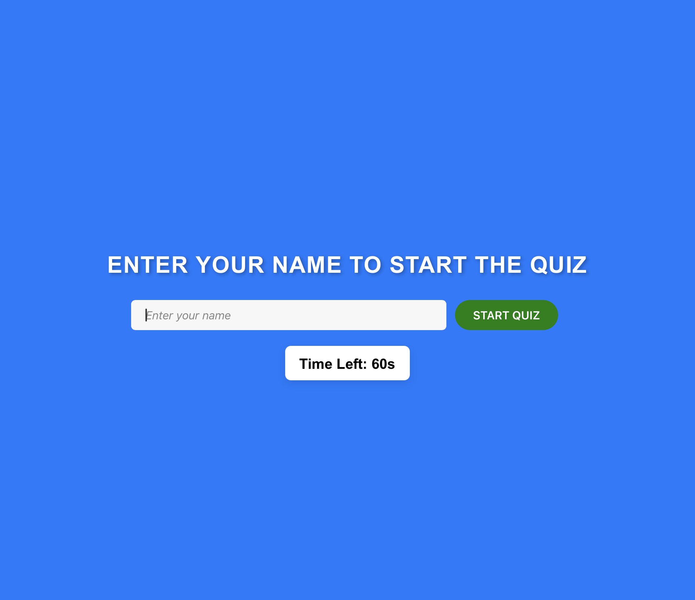
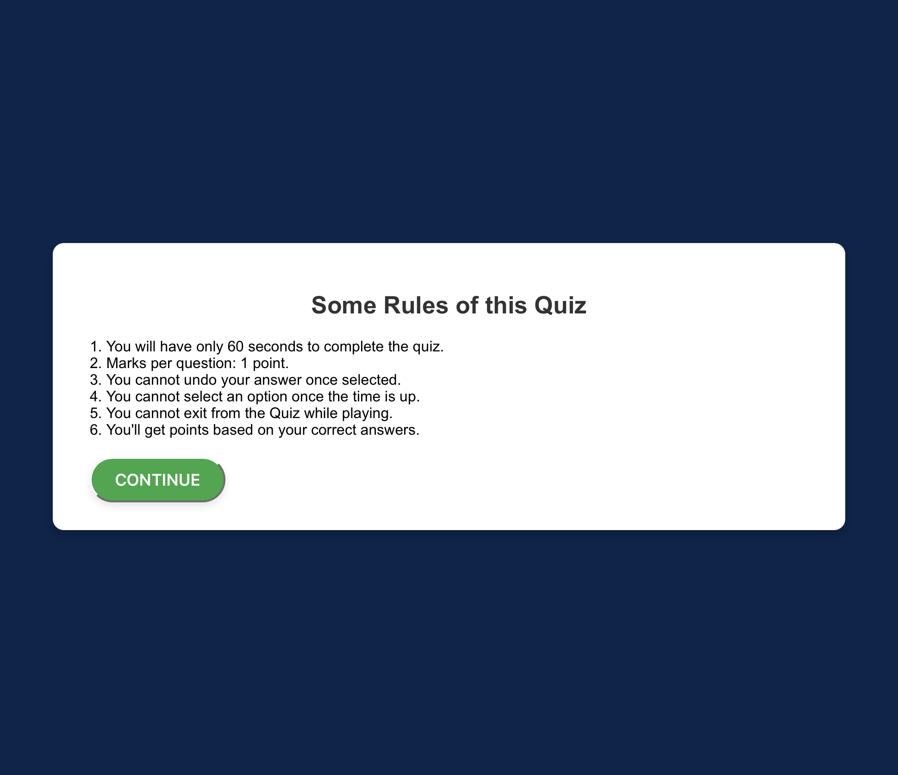

## ScreenShots 





## Overview
This is a simple quiz application built with React. Users can answer questions, track their score, and view a leaderboard.

## Features
- Timed quiz with 60 seconds to answer.
- Tracks the user’s score and streak.
- Displays a leaderboard.
- Responsive design.

## Setup Instructions
1. Clone the repository:
   ```bash
   git clone https://github.com/yourusername/quiz-app.git
   cd quiz-app 
# install dependencies 
- npm install
 
## run the app
 ```bash
npm start 

##Visit http://localhost:3000 in your browser.
